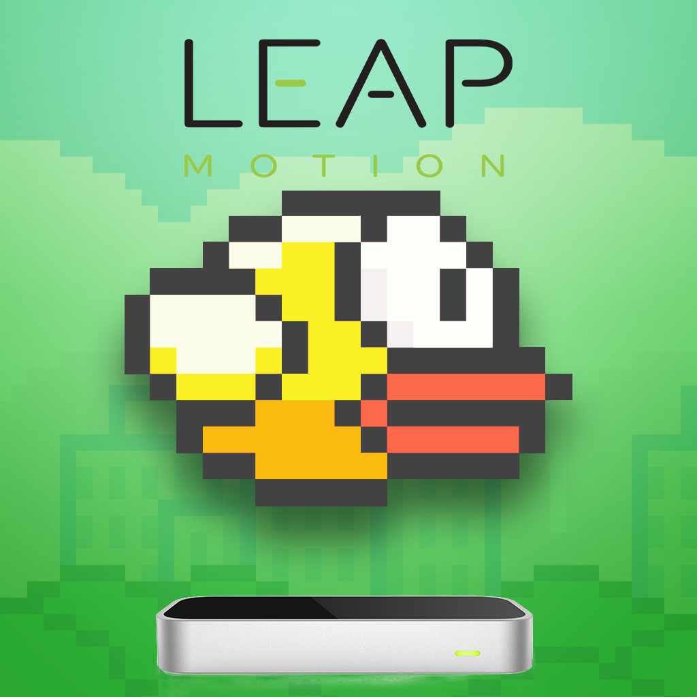
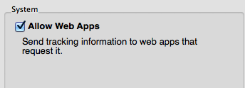
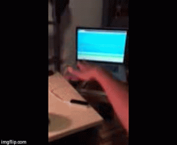

# Flappy Leap Bird

## Description

A clone of the popular game 'Flappy Bird'. Initially developed by [Nebez](https://github.com/nebez/floppybird/), I have expanded the game to enable controlling the Flappy Bird with the [Leap Motion](http://leapmotion.com) controller. This application uses all of the protocols and frameworks used by the original author in addition to the [LeapJS](http://developer.leapmotion.com/leapjs/) API for the Leap Motion.

## Usage

For this game to function correctly, the user must have the Leap Motion client application installed, with the option to enable webapps turned on, as shown below:

The user will have to make a vertical 'flapping' motion with their hand for the game to register a 'flap' in the game.

## Demo

This application is hosted using Github Pages. To use the live demo, navigate to: http://rukmal.github.io/FloppyLeapBird.

## Notice

The assets powering the visual element of the game have all been extracted directly from the Flappy Bird android game.

I do not own the assets, nor do I have explicit permission to use them from their creator. They are the work and copyright of original creator Dong Nguyen and [.GEARS games](http://www.dotgears.com/).

## Original License - HTML5 implementation of 'Flappy Bird'

Copyright 2014 Nebez Briefkani

Licensed under the Apache License, Version 2.0 (the "License");
you may not use this file except in compliance with the License.
You may obtain a copy of the License at
http://www.apache.org/licenses/LICENSE-2.0

Unless required by applicable law or agreed to in writing, software
distributed under the License is distributed on an "AS IS" BASIS,
WITHOUT WARRANTIES OR CONDITIONS OF ANY KIND, either express or implied.
See the License for the specific language governing permissions and
limitations under the License.

### Leap Motion Integration

See [LICENCE](LICENSE).

## Contact

This is an open source project. Contact me if you have a suggested improvement or fork and send a pull request!

http://rukmal.me
